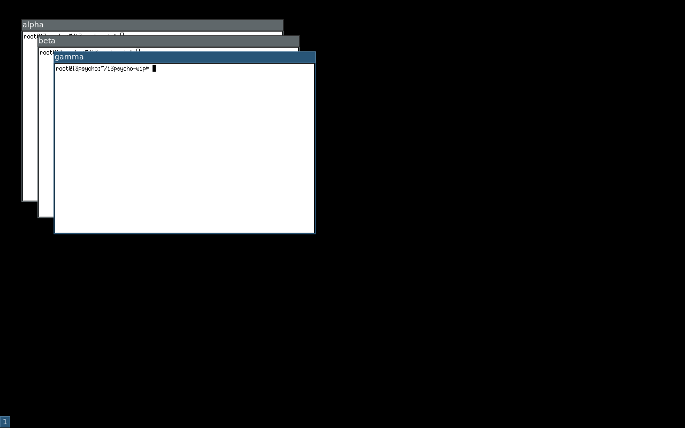
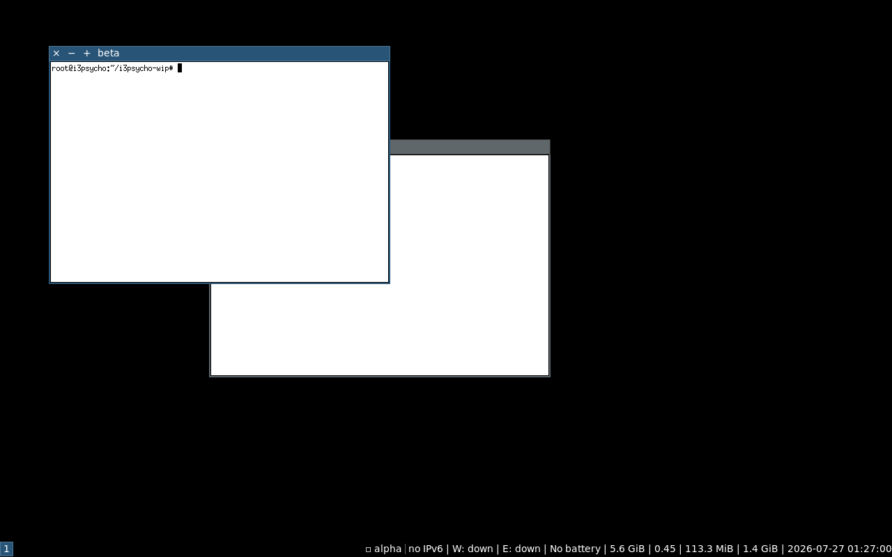
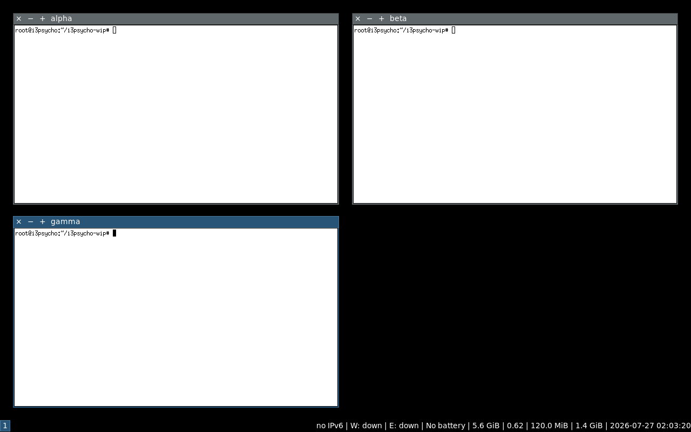
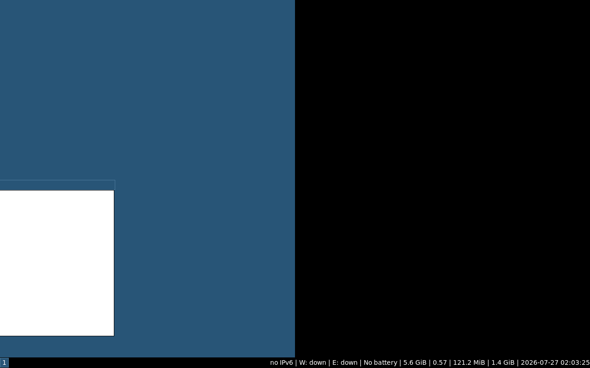

# i3psycho (wip)

i3 for psychopaths: floating-first i3, macOS-grade window behavior, the blue titlebar kept sacred.

The plan is canonical and lives in [i3psycho-plan](https://github.com/ekruges/i3psycho-plan).

## Install

Arch: `cd packaging && ./mkpkgfiles.sh && makepkg -si` (provides/conflicts
`i3-wm`, like i3-gaps did). Other distros: `./packaging/build-i3psycho.sh`,
then install psychod/psychod{.py,-status}. Existing i3 users add ONE line
to their config: `include /usr/share/i3psycho/psycho.conf`. Full docs:
**[docs/USERGUIDE.md](docs/USERGUIDE.md)** - install, every keybind, every
action, every deviation from stock i3, troubleshooting.

## Why this is not a toy

- **Upstream i3's complete test suite passes** against the patched binary:
  284 files, 4190 tests. The fork is 4 rebasable patches on i3 master, the
  i3-gaps model, and vanilla i3 configs run unmodified.
- **In-app minimize buttons actually work** (stock i3 rejects iconify
  requests). Minimized windows carry proper EWMH/ICCCM state, restore in
  place, and show as clickable chips in the bar.
- **psychod cannot take the session down**: pure IPC client, action-level
  fault isolation, automatic reconnect across i3 restarts, one instance
  per display.
- Measured action latency 1.9 ms mean on a 2-core container; release
  builds by default; zero per-frame work at drag edges.

## The look

Cascade, buttons, expose grid, drag-snap preview - all in stock i3 visual
language, which is frozen on purpose:

 
 

## Status

`psychod` (Python, i3ipc, apt-installable deps only) now does the macOS part:
cascade placement of new windows, exact-workarea snapping (keyboard binds and
drag-beyond-edge), minimize with geometry restore, show desktop, MRU alt-tab,
and a minimized-window dock in the bar (`psychod-status` statusline wrapper,
click a chip to restore). `test/phase1.sh` verifies all of it headless under
Xvfb; `test/phase0.sh` still covers the config-only layer.

Phase 3, same UI, all behavior (the look is frozen on purpose):
- **Expose** (`$mod+e`, hot corner top-left): every float arranged in a real
  window grid; toggle again, click, or alt-tab to restore all rects exactly.
  No compositor needed, no new UI surfaces.
- **Drag-to-edge with live preview** (fork patch 0003): solid i3-blue preview
  under the dragged window for halves / max / quarters, exact snap on drop.
- **MRU alt-tab cycling** (`$mod+Tab`): repeated presses walk the stack,
  1.2s pause commits.
- **Hot corners** (psychod): top-left expose, bottom-right show desktop,
  `--hot-corners tl=...,br=...` or `none`.
- **Multi-monitor correct**: cascade and snapping are per-output workarea
  (fake-outputs tested).
- **Butter**: release-build i3 (`--buildtype=release`), event-driven +
  adaptive polling in psychod (0.15s active / 0.6s idle), zero per-frame work
  at drag edges, and `dist/picom.conf` = an invisible compositor config
  (vsync only, all eye candy off). Measured action latency in the build CT:
  mean 1.9 ms, max 3.0 ms tick-to-geometry.

Phase 2 added the C patches (see `patches/`), built and verified on the CT:
- **Titlebar buttons** on floating windows: x (close), − (iconify to
  scratchpad), + (fullscreen). Minimal glyphs in the titlebar text color,
  macOS placement, themed by existing `client.*` directives. `deco_buttons.c`
  module, hit-tested in `route_click()` before drag/resize.
- **Double-click titlebar** toggles fullscreen (classic floating-WM behavior).
- **`window::move` IPC events for floating repositions** - upstreamable fix;
  psychod's poller keeps working on stock i3 either way, and retro-saves
  geometry for ANY scratchpad iconification (button, bind, or tick).

`test/phase2.sh` drives the buttons with xdotool clicks and verifies all of
it headless. `packaging/build-i3psycho.sh` builds upstream + patches.

Known behavior:
- Terminals with size-hint increments (xterm) snap to the nearest character
  cell, so sub-cell gaps are normal - same as every WM, macOS included.
- On stock i3, drop-snap relies on the 0.3s rect poll (no move events there).
  On the patched i3, moves emit events; the poller works for both.

Next: true `_NET_WM_STATE_HIDDEN` minimize, PKGBUILD for the AUR, upstream the 0001 patch.

Layout (will grow per the plan):

```
i3/          # patched i3 fork, branch `psycho`, rebased on upstream tags
psychod/     # companion IPC daemon (Python, i3ipc)
dist/        # default config, picom.conf, skippy-xd.conf, rofi theme
packaging/   # PKGBUILD and friends
```
